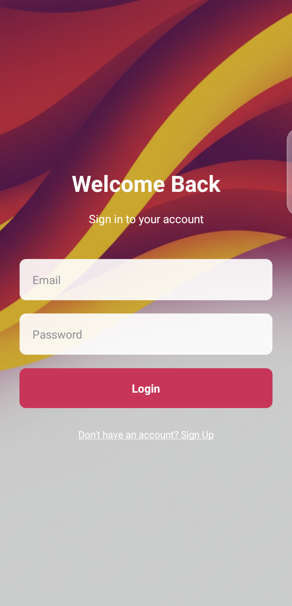
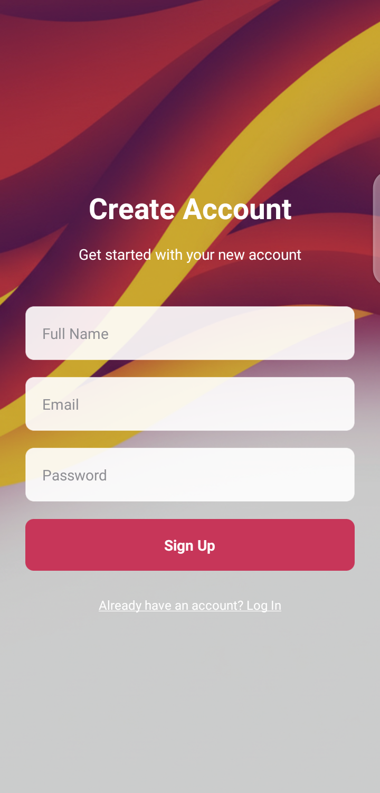
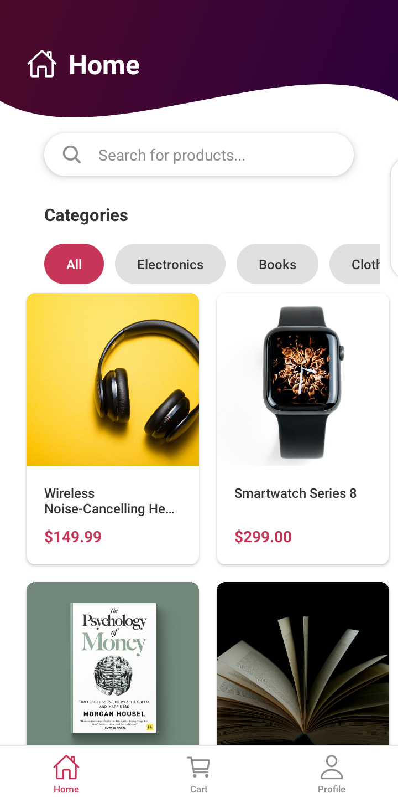
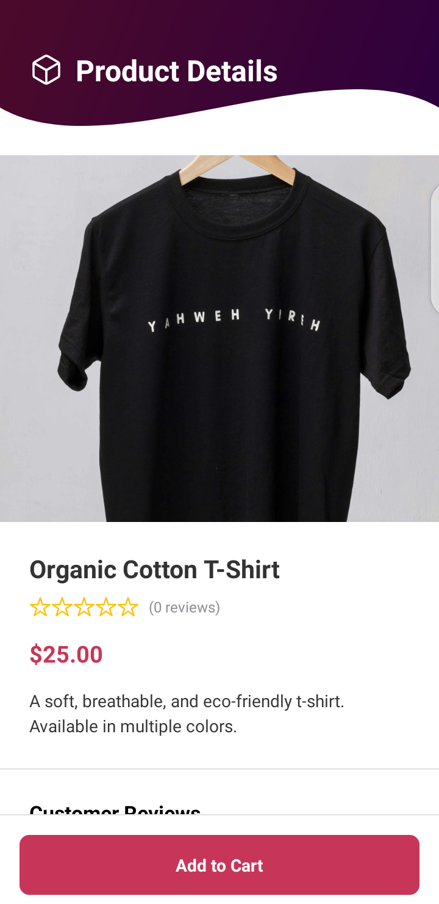
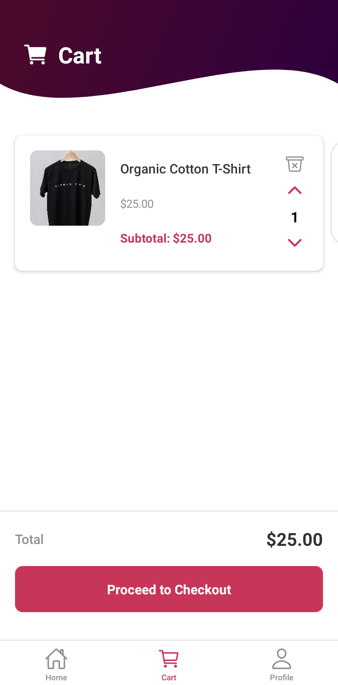
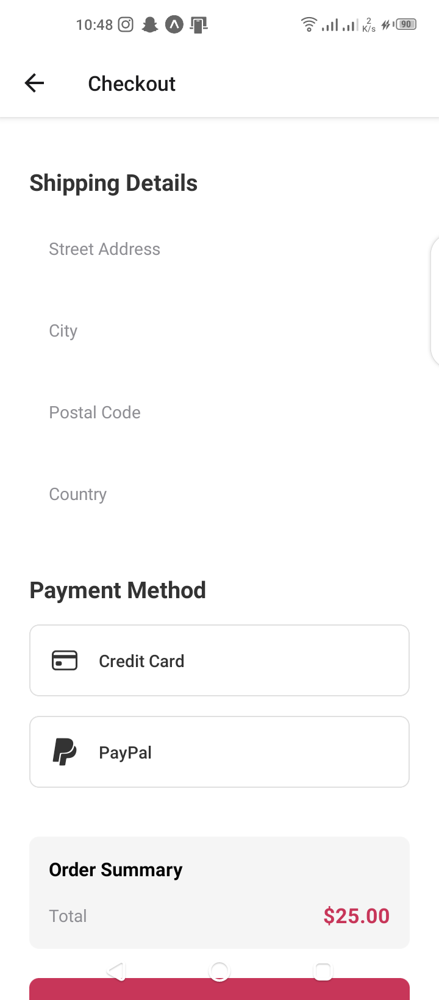
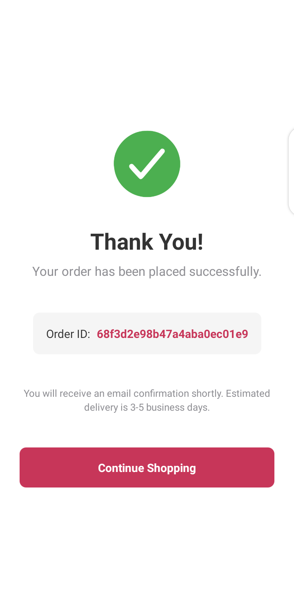
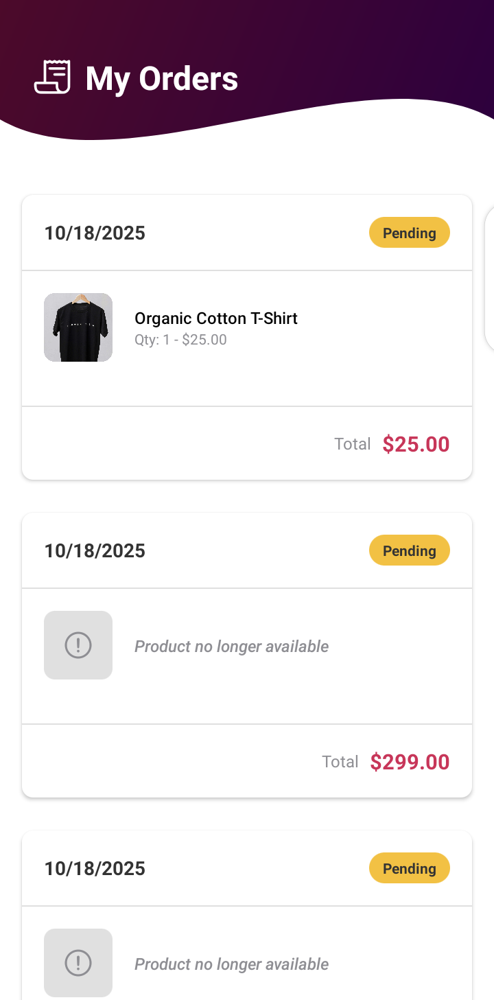
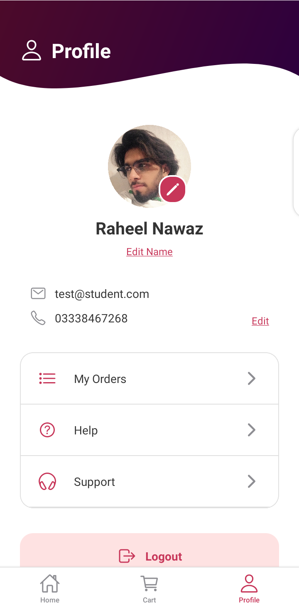

E-Commerce App (Online Shopping) - Assignment 2

This repository contains the complete source code for a full-stack e-commerce mobile application built with React Native (Expo), Node.js (Express), and MongoDB.

Getting Started

To get a local copy up and running, you can clone the repository.

git clone https://github.com/Raheel2k4/E-Commerce-App
cd ecommerce-app

Repository Structure

ecommerce-app/
├── frontend/          (React Native Expo app)
├── backend/           (Express.js server)
├── screenshots/       (Contains all application screenshots)
└── README.md

How to Run the Application

Prerequisites

Node.js and npm

Expo Go app on your mobile device

A local MongoDB server installed and running

1. Backend Server Setup

First, set up and run the backend server.

# 1. Navigate to the backend directory
cd backend

# 2. Install dependencies
npm install

# 3. (One-time only) Seed the database with product data
npm run seed

# 4. Start the server (using nodemon for auto-restarts)
npm run dev

The server will be running on http://localhost:3000.

2. Frontend Application Setup

Next, set up and run the React Native Expo frontend.

Important: Ensure your mobile phone and your computer are connected to the same Wi-Fi network.

The application is configured to automatically detect the IP address of the machine running the Expo server. You do not need to manually edit any configuration files.

# 1. Navigate to the frontend directory
cd frontend

# 2. Install dependencies
npm install

# 3. Start the Expo development server
npx expo start -c

A QR code will appear in the terminal. Scan this QR code with the Expo Go app on your mobile phone to launch the application.

Database Setup

This project uses a local MongoDB database.

Connection String: The server connects to mongodb://127.0.0.1:27017/ecommerce.

Setup: Ensure your local MongoDB service is running before starting the backend server. The database and collections will be created automatically when the server runs the seeder script for the first time.

Frontend-Backend Communication

The React Native (Expo) frontend uses the axios library to send HTTP requests to the backend for all data operations (e.g., fetching products, logging in, updating the cart).

The Node.js (Express) backend receives these requests, processes them using middleware for authentication, queries the MongoDB database with mongoose, and sends back a JSON response.

User authentication is handled via JSON Web Tokens (JWT), which are sent in the Authorization header of authenticated requests.

Screenshots

Authentication

Login Screen

Signup Screen

Main Application

Home Screen

Product Details

Cart Screen

Checkout Screen

Order Confirmation

My Orders

Profile Screen

